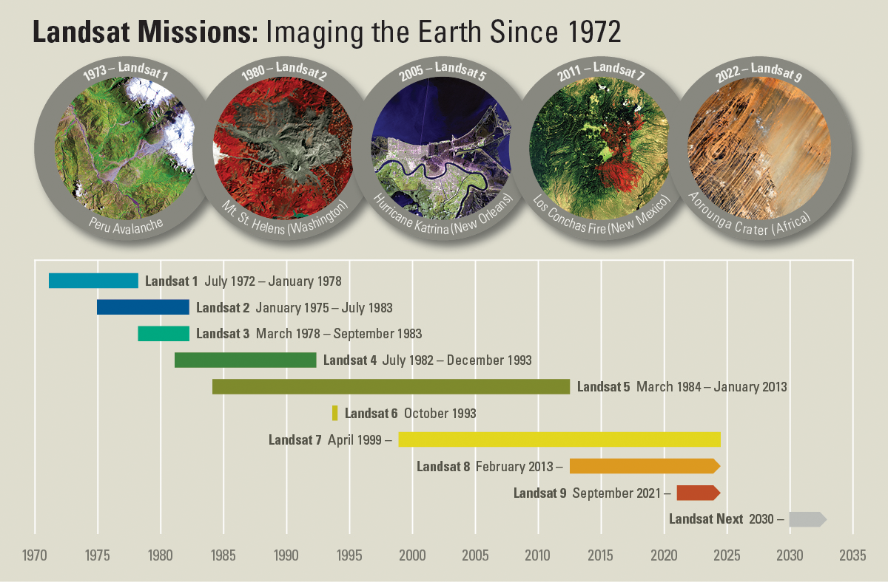

```{r echo = FALSE, message = FALSE, warning = FALSE}
library(here)
#library(tidyverse)
#library(knitr)
library(kableExtra)
library(readxl)
#library(fs)
#library(countdown)
library(xaringan)
library(xaringanExtra)
#library(knitr)

#hook_source <- knitr::knit_hooks$get('source')
#knitr::knit_hooks$set(source = function(x, options) {
#  x <- stringr::str_replace(x, "^[[:blank:]]?([^*].+?)[[:blank:]]*#<<[[:blank:]]*$", "*\\1")
#  hook_source(x, options)
#})

#xaringanExtra::use_broadcast()
#xaringanExtra::use_freezeframe()
#xaringanExtra::use_scribble()
#xaringanExtra::use_search(show_icon = TRUE, auto_search	=FALSE)
#xaringanExtra::use_freezeframe()
#xaringanExtra::use_clipboard()
#xaringanExtra::use_tile_view()
#xaringanExtra::use_panelset()
#xaringanExtra::use_editable(expires = 1)
xaringanExtra::use_fit_screen()
#xaringanExtra::use_extra_styles(hover_code_line = TRUE, mute_unhighlighted_code = TRUE)

```

```{r setup, include=FALSE}
options(htmltools.dir.version = FALSE)
knitr::opts_chunk$set(
  fig.width=9, fig.height=3.5, fig.retina=3,
  out.width = "100%",
  cache = FALSE,
  echo = TRUE,
  message = FALSE, 
  warning = FALSE,
  hiline = TRUE
)
```

```{r xaringan-themer, include=FALSE, warning=FALSE}
library(xaringanthemer)
style_duo_accent(
  primary_color = "#1381B0",
  secondary_color = "#FF961C",
  inverse_header_color = "#FFFFFF"
)
```


# Summary: Landsat 5

- Part of Landsat programme managed by NASA and United States Geological Survey (USGS)
- Launched in 1984; decommissioned in 2013 (29 year lifespan)
- Guiness World Record: 'Longest Operating Earth Observation Satellite'
  - Original life expectancy of 3 years
  - Orbited at 705 km above Earth
- Circled the Earth every 99 minutes, with 14 orbits per day
- Passive sensor: relying on sunlight reflected and emitted from the Earth's surface

<center></center>


---

# Summary: Overview of Sensors

```{r echo=FALSE}
# Load the data from the Excel file
eo_data_df <- read_excel("week2_sensoroverview.xlsx")

# Use kable and kableExtra to create a table with merged cells
kable_out <- kable(eo_data_df, "html", escape = FALSE, align = 'l') %>%
  kable_styling(bootstrap_options = c("bordered", "condensed"), full_width = TRUE, font_size = 10) %>%
  collapse_rows(valign = "middle")

### ALTERNATIVE TO ABOVE CODE ###
# Load the data from the Excel file
#eo_data_df <- read_excel("week2_sensoroverview.xlsx")

# Use kable and kableExtra to create a table with merged cells
#kable_out <- kable(eo_data_df, "html", escape = FALSE, align = 'l') %>%
#  kable_classic(full_width = TRUE, font_size = 10) %>%
#  kable_styling()
##################################

# Print the table
kable_out
```

---

# Summary: Purposes

Landsat 5 was originally designed to continue the Landsat program's objective of monitoring Earth's land surface. The primary purposes were:
- Monitoring environmental change to inform land use planning and environmental policy.
- Supporting agricultural and forestry management through detailed observations of land cover and vegetation health.
- Assisting in the management of water resources by mapping the extent and health of water bodies.
- Contributing to disaster response efforts by providing detailed images of affected areas.
By collecting data across different wavelengths of light, Landsat 5 was able to detect variations in the Earth's surface not visible to the naked eye.  
For example, healthy vegetation strongly reflects near-infrared light, while diseased or stressed vegetation reflects less, allowing scientists to assess plant health across vast areas. Similarly, the thermal band was used to estimate soil moisture levels, a crucial factor in agriculture and drought assessment.  

---

# Application Forest Management

Forest Type Classification: Landsat 5 data is used to classify different forest types based on spectral signatures. By analyzing the reflectance values of different wavelengths captured by Landsat 5 sensors, researchers and forest managers can differentiate between various forest types such as deciduous, coniferous, and mixed forests. This information is essential for understanding the distribution and composition of forests, which in turn aids in forest management and conservation efforts.

Biomass Estimation: Landsat 5 data is utilized for estimating forest biomass, which is crucial for assessing carbon stocks and understanding forest health. By correlating spectral information from Landsat 5 imagery with ground-based measurements of biomass, researchers can develop models to predict biomass distribution across forested areas. This information is valuable for monitoring changes in biomass over time, assessing the effectiveness of forest management practices, and implementing strategies for carbon sequestration and climate change mitigation.

Disturbance Detection: Landsat 5 data is instrumental in detecting forest disturbances such as wildfires, insect outbreaks, and logging activities. By comparing multispectral imagery from different time periods, forest managers can identify changes in forest cover and detect areas affected by disturbances. Landsat 5's long-term archive of imagery allows for the monitoring of forest disturbances over extended periods, enabling timely response and management interventions to mitigate the impacts of disturbances on forest ecosystems.

---

# Application: River Management

Landsat 5 has been a vital tool for river monitoring and management due to its comprehensive data collection capabilities. Here's a summary of how it has been utilized for river monitoring:

- Water Quality Assessment: Landsat 5's spectral bands, especially those in the visible and near-infrared wavelengths, allow for the assessment of water quality by detecting suspended sediments, algal blooms, and other water quality indicators. Changes in these indicators over time can be monitored to assess the impact of pollution, agricultural runoff, and industrial discharge on rivers.
- River Dynamics and Morphology: The high spatial resolution of Landsat 5 images enables the detailed mapping of river courses, changes in river morphology, and sediment transport. This information is crucial for understanding natural processes like erosion and sediment deposition, as well as human-induced changes such as dam construction and river diversion.
- Flood Mapping and Management: Landsat 5 data has been widely used to map flood extents and assess flood damage. By comparing pre- and post-flood imagery, authorities can quickly identify affected areas, making it easier to coordinate response efforts and plan for flood mitigation and recovery.
- Vegetation and Wetland Monitoring: The near-infrared and short-wave infrared bands of Landsat 5 are particularly useful for monitoring vegetation health and wetland extents around rivers. This information helps in the conservation of riparian zones and wetlands, which are critical for maintaining biodiversity and providing natural water filtration.
- Long-term Environmental Monitoring: Perhaps one of the most significant contributions of Landsat 5 is its long operational life, which has provided a continuous data record over nearly three decades. This long-term dataset is invaluable for studying environmental changes, climate change impacts on river systems, and the effectiveness of river management and conservation strategies over time.

The combination of Landsat 5's spectral capabilities, spatial resolution, and extensive data archive has made it an indispensable resource for environmental scientists, water resource managers, and policy-makers involved in river monitoring and management.

---

# Application: Agricultural Monitoring

Crop Monitoring: Landsat 5 imagery is extensively used for monitoring crop growth and health. By analyzing multispectral data from Landsat 5 sensors, researchers and farmers can track changes in vegetation indices such as NDVI (Normalized Difference Vegetation Index) over time, which provides insights into crop vigor, stress levels, and phenological stages. This information is crucial for making informed decisions related to irrigation scheduling, fertilizer application, and pest management.

Yield Estimation: Landsat 5 data is employed for estimating crop yields by analyzing the relationship between spectral reflectance and crop biomass. By calibrating Landsat 5 imagery with ground-based measurements of crop yield, researchers can develop models to predict crop productivity across agricultural landscapes. This information enables farmers to optimize agricultural practices, allocate resources efficiently, and plan for harvest operations.

Land Use Mapping: Landsat 5 imagery is used for mapping agricultural land use and land cover types. By classifying Landsat 5 multispectral data into different categories such as cropland, pasture, and fallow land, researchers can assess changes in land use patterns over time and monitor agricultural expansion or intensification. This information supports land use planning, natural resource management, and policy development aimed at promoting sustainable agriculture.

---

# Reflection: Longevity

One of the most remarkable features of Landsat 5 is its extraordinary longevity, far surpassing its expected operational lifespan of three years. Over its nearly 29 years in orbit, the satellite acquired a vast amount of data, totaling over 2.5 million images of Earth's surface.

This longevity has yielded numerous benefits for environmental monitoring, resource management, and scientific research. Landsat 5's extensive data archive provides a valuable historical record of global land cover and land use changes, allowing scientists to analyze trends, detect anomalies, and assess the impact of human activities on the environment.

Furthermore, Landsat 5's long-term data continuity has facilitated the development of consistent, reliable datasets for various applications, including land cover mapping, vegetation monitoring, and water resource management. Researchers and policymakers rely on Landsat 5 data to make informed decisions about land use planning, natural resource conservation, and disaster response.

In addition, Landsat 5's longevity has paved the way for future satellite missions, demonstrating the feasibility and benefits of long-term Earth observation programs. The satellite's remarkable durability has inspired confidence in the reliability and effectiveness of satellite-based remote sensing for monitoring and managing Earth's resources.

In conclusion, Landsat 5's longevity has provided a wealth of data that has been instrumental in advancing scientific understanding, informing decision-making, and addressing pressing environmental challenges. Its legacy as the longest-operating Earth observation satellite underscores the importance of sustained observation efforts in monitoring and preserving the health of our planet.


---

# Reflection: Climate Change

Landsat 5's superior level of resolution has greatly impacted climate change research by providing detailed, long-term data on Earth's surface dynamics. The satellite's Thematic Mapper (TM) sensor, with its high spatial resolution of 30 meters, enabled scientists to detect and monitor subtle changes in land cover, vegetation health, and land surface temperature.

By analyzing Landsat 5 imagery, researchers have been able to assess the impacts of climate change on various ecosystems, including forests, wetlands, and agricultural lands. They have observed changes such as shifts in vegetation patterns, alterations in land use, and changes in snow cover extent, all of which are key indicators of climate change effects.

Moreover, Landsat 5's extensive data record spanning nearly three decades has facilitated long-term studies of climate change trends. By comparing imagery from different time periods, scientists can quantify changes in land cover, monitor the rate of deforestation, and assess the vulnerability of ecosystems to climate-related disturbances such as wildfires and droughts.

Overall, Landsat 5's contribution to climate change work lies in its ability to provide high-resolution, long-term data that enhances our understanding of the Earth's changing climate and supports efforts to mitigate its impacts.


---

# References
